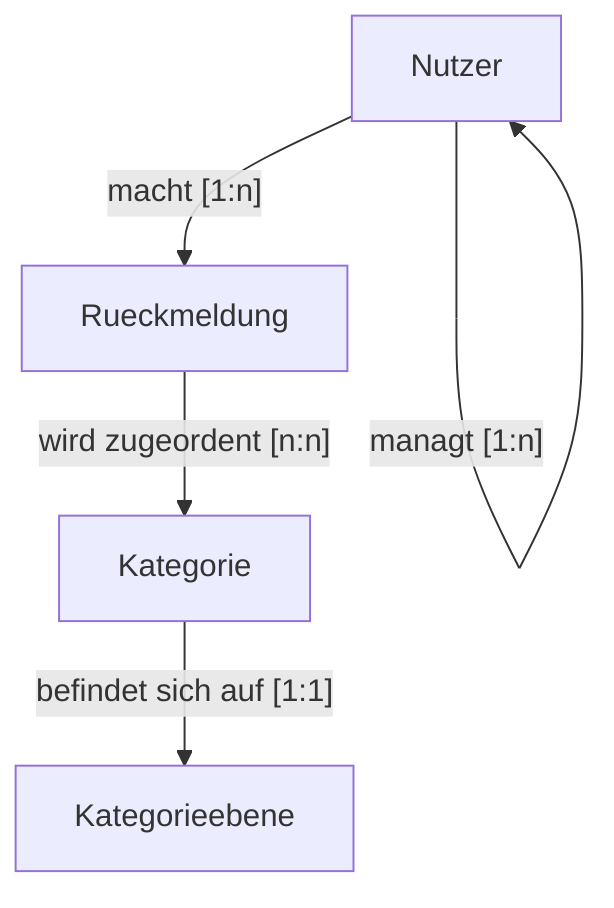

```mermaid
graph TD
Nutzer -- "managt [1:n]" --> Nutzer
Nutzer -- "macht [1:n]" --> Rueckmeldung
Rueckmeldung -- "wird zugeordent [n:n]" --> Kategorie
Kategorie -- "befindet sich auf [1:1]" --> Kategorieebene
```
